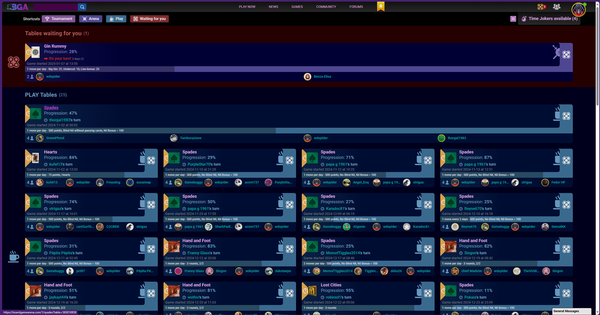
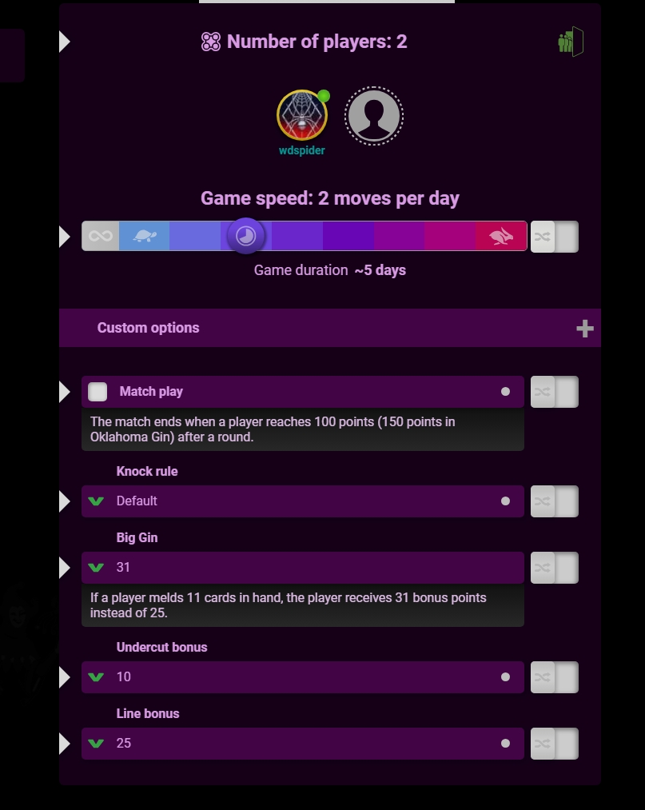

# BoardGameArena Dark Mode Theme

I've created a dark mode theme for [BoardGameArena](https://boardgamearena.com/) with purple and pink hues. I haven't done much specific game customization yet as most of the games I play work well without additional tweaks.

## How to "install"

1. Go to the [Advanced Tab](https://boardgamearena.com/preferences?section=advanced) within your profile.
2. Copy the contents of the [dist/theme.min.css](dist/theme.min.css) file.
3. Paste the contents into the textbox on the Advanced tab.
4. Click save.

## Screenshots

### Current Tables

### Game Page

### Gin Game

### Game Panel (WIP)

### Profile - Advanced Tab

